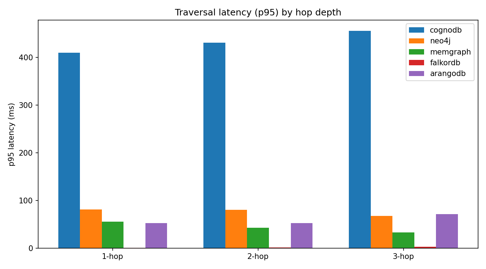
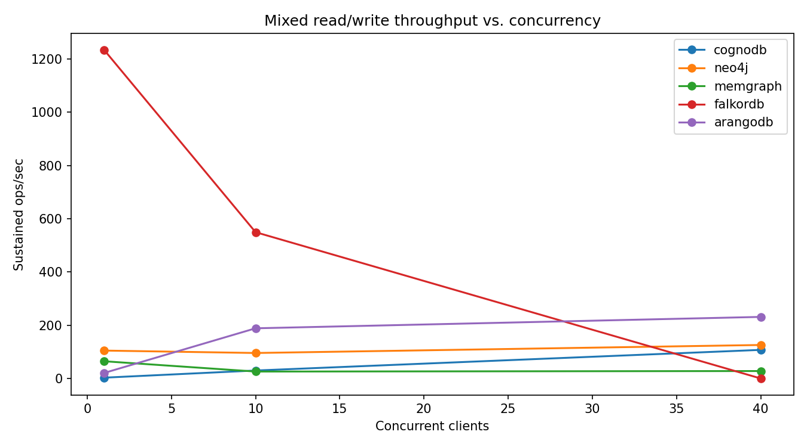

# CognoDB Cloud vs. Managed/Self-Hosted Graph Databases — A Reproducible Benchmark

> Wexa AI take-home assignment: benchmark CognoDB Cloud against at least four
> other graph database platforms, on the same dataset and workloads, and
> report the results honestly. This repo is the benchmark suite, the raw
> results, and the write-up.

## TL;DR

- **Platforms:** [CognoDB Cloud](#why-these-five-platforms) (managed, free
  tier) vs. **Neo4j**, **Memgraph**, **FalkorDB**, **ArangoDB** (all
  self-hosted via Docker, resource-capped to match CognoDB's free tier).
- **Dataset:** SNAP `email-Enron` — 36,692 nodes / 367,662 directed
  relationships. Identical data, identical queries, identical start-node
  sample on every platform.
- **One command reproduces everything:** `scripts/run_all.ps1` (Windows) or
  `scripts/run_all.sh` (Linux/Mac) — see [Reproducing this benchmark](#reproducing-this-benchmark).
- **Results:** see [Results](#results) below — real numbers from a live run
  against a CognoDB free instance and the local Docker stack, executed
  2026-08-20 (see [Status of this repo](#status-of-this-repo)). FalkorDB is
  the fastest single-client reader here by a wide margin but the first to
  hit a hard concurrency ceiling; Memgraph is the slowest to load by two
  orders of magnitude under this exact resource cap. Full breakdown in
  [Analysis](#analysis).

## Table of contents

1. [Why these five platforms](#why-these-five-platforms)
2. [Fairness: resource parity across every platform](#fairness-resource-parity-across-every-platform)
3. [Dataset](#dataset)
4. [Methodology](#methodology)
5. [Reproducing this benchmark](#reproducing-this-benchmark)
6. [Results](#results)
7. [Analysis](#analysis)
8. [Caveats & honest limitations](#caveats--honest-limitations)
9. [How this repo maps to the evaluation criteria](#how-this-repo-maps-to-the-evaluation-criteria)
10. [Status of this repo](#status-of-this-repo)

## Why these five platforms

CognoDB Cloud speaks **Bolt + Cypher** through the official Neo4j driver
(the assignment's own setup instructions confirm this). To keep the
comparison meaningful rather than arbitrary, the four comparison platforms
were chosen to answer three different questions at once:

| Platform | Why it's here |
|---|---|
| **Neo4j** | The reference implementation of Bolt + Cypher, and the most likely thing CognoDB is positioning itself against directly. If CognoDB is protocol-compatible, this is the closest apples-to-apples comparison possible. |
| **Memgraph** | A second independent Cypher engine (in-memory, C++), so we get more than one data point for "how do different Cypher implementations perform on identical queries," not just CognoDB-vs-Neo4j. |
| **FalkorDB** | Cypher again, but on a completely different storage engine (sparse-matrix/GraphBLAS via Redis), which stress-tests whether the "same query, different engine" comparison holds up on a very different architecture. |
| **ArangoDB** | The deliberate outlier: multi-model, AQL instead of Cypher. Included so the benchmark isn't just "four flavors of Cypher" — it shows what changes (and what doesn't) when the query language itself differs, which is a real switching-cost question for anyone evaluating CognoDB. |

All four are either free-tier/self-hostable at no cost, all have first-class
Python clients, and all are credible, currently-maintained products (not
toy/abandoned projects) — this was itself part of the selection bar.

**Rejected candidates and why:** Amazon Neptune (no meaningful free tier —
would violate the fairness rule outright), TigerGraph Cloud and Azure Cosmos
DB Gremlin API (free tiers exist but are usage-credit-based rather than a
fixed small instance, making resource parity hard to state precisely and
harder for a third party to reproduce for free).

## Fairness: resource parity across every platform

Per the assignment's fairness note, every platform runs on the same
resource envelope as CognoDB's free `c0` instance:

| Platform | vCPU | RAM | Disk | How enforced |
|---|---|---|---|---|
| CognoDB Cloud | burst to 0.5 | 512MB | 1GB (500 IOPS, 200 connections) | Vendor's free "c0" tier, as-is |
| Neo4j | 0.5 | 512MB (heap capped to 256MB + 128MB page cache) | volume, unbounded but dataset is ~50MB | `docker-compose.yml`: `cpus: 0.5`, `mem_limit: 512m` |
| Memgraph | 0.5 | 512MB (`--memory-limit=400`) | same | same |
| FalkorDB | 0.5 | 512MB (`--maxmemory 400mb`) | same | same |
| ArangoDB | 0.5 | 512MB | same | same |

**RAM discrepancy, now resolved:** the assignment PDF's prose says CognoDB's
free tier is "256 MB RAM"; cognodb.com/pricing, fetched directly on
2026-08-20, states "512 MB" (along with "burst to 0.5 vCPU," "1 GB" disk,
"200" connections, "up to 500 IOPS," "no card required"). We're treating the
live pricing page as authoritative since it's the more specific, checkable,
and current source, and capped the four self-hosted platforms to match it
(512MB). If you re-run this later and CognoDB's page has changed, re-check
and update this line — vendor pricing pages are not a fixed target.

**CognoDB instance region:** `us-east4` (N. Virginia) — the only region
offered on the free `c0` tier at signup time (2026-08-20); there was no
region picker to choose a closer location. The benchmark client itself runs
from India. The four self-hosted platforms run in Docker on that same
machine, so they have effectively zero network latency; CognoDB is a real
cross-continent network hop. This is a genuine, unavoidable asymmetry given
the assignment mandates CognoDB Cloud specifically and its free tier is
single-region — documented here rather than hidden, and discussed further in
[Caveats](#caveats--honest-limitations).

## Dataset

[SNAP `email-Enron`](https://snap.stanford.edu/data/email-Enron.html) —
Enron email communication network released by the FERC investigation,
public domain, anonymized to integer node IDs by Stanford.

- **36,692 nodes**, **367,662 directed relationships** (an edge `i -> j`
  means `i` sent at least one email to `j`; SNAP's own page describes the
  graph as undirected with 183,831 edges, but the published edge list
  contains both directions of each communicating pair, so this harness
  keeps the directed representation — arguably more realistic for an email
  graph, and it's what `data/prepare_dataset.py` actually loads).
- Sits inside the assignment's suggested 100k–500k relationship range and
  comfortably fits a 1GB disk / 512MB RAM tier.
- Every node gets two **synthetic** properties, generated deterministically
  from a fixed seed (`20260819`) so every platform sees byte-identical
  data: `email_hash` (a truncated SHA-1 of the node ID — not a real email
  address) and `dept` (one of 10 fixed department names, seeded pseudo-random
  assignment). These exist purely so the benchmark has something to filter
  and group by for the lookup/aggregation metrics — SNAP's raw dataset has
  no such attributes.
- `data/prepare_dataset.py` also writes `sample_start_nodes.json`: 200 node
  IDs sampled once, from the same seed, and reused as the traversal/lookup
  start points on **every** platform — so hop-depth comparisons aren't
  comparing different random walks on different platforms.

Load method: driver-side batched writes (`UNWIND` in 1,000-row batches for
the four Cypher platforms, `insert_many` in 1,000-doc batches for ArangoDB)
— not a bulk-import tool, so ingest numbers reflect realistic
application-level loading, not each vendor's fastest possible bulk loader.
This is a deliberate, stated choice — see [Caveats](#caveats--honest-limitations).

## Methodology

- **Same logical query, per platform's native language.** Cypher queries
  (`src/common/queries.py`) are shared verbatim across CognoDB/Neo4j/
  Memgraph/FalkorDB; AQL translations for ArangoDB express the identical
  logical query (same hop depth, same filter, same aggregation).
- **Cold start:** the first query issued after connecting, before any
  warm-up iterations, is timed separately and reported as `cold_start_ms`.
  Precisely: the driver's connection handshake (`verify_connectivity()`)
  happens first and is *not* included in this number — `cold_start_ms`
  isolates first-query cost (query planning/caching cold, no prior page
  cache warmth) from raw network/TLS handshake cost, rather than bundling
  both under one label. It's still distinct from every category's
  warmed-up p50/p95/p99 below — see the assignment's "what a strong
  submission looks like" note on separating warm vs. cold
  numbers.
- **Warm-up:** 20 untimed iterations per query category before measurement.
- **Measurement:** 100 timed iterations per read workload (exceeds the
  assignment's suggested ≥100 minimum), wall-clock per-call latency
  recorded client-side, p50/p95/p99 reported (not just mean).
- **Mixed workload:** concurrent clients (default sweep: 1 / 10 / 40) each
  running 90% reads (1-hop traversal from a random start node) / 10% writes
  (new relationship insert) for a fixed 20-second window per concurrency
  level; sustained ops/sec reported per level.
- **Same client, same network path:** all runs execute from the same
  machine in the same session, back-to-back, so network/CPU noise is at
  least consistent across platforms within one run (see caveats on
  variance below).
- **Automation:** `scripts/run_all.ps1` / `run_all.sh` run the entire
  pipeline — dataset prep, load, workloads, footprint, report — with zero
  manual steps beyond providing credentials in `.env`.
- **Failure isolation:** every load/query/mixed-workload step is individually
  caught. A single platform timing out, throttling, or dropping a connection
  is recorded as `"error": "..."` in that platform's `results/<platform>.json`
  and the harness moves on — it does not discard already-collected results
  for that platform, and it does not abort benchmarking of the other four.
  This is what makes "record every caveat honestly... timeouts, failed runs"
  (assignment §5.3) actually enforceable rather than aspirational.
- **Load verification:** after loading, each loader re-queries the platform
  for its actual node/relationship count (`verified_node_count` /
  `verified_edge_count` in the results JSON) so "identical dataset on every
  platform" is a checked fact, not just an assumption.

## Reproducing this benchmark

```bash
git clone <this-repo-url>
cd wexa-cognodb-benchmark
python -m venv .venv && source .venv/bin/activate   # Windows: .venv\Scripts\Activate.ps1
pip install -r requirements.txt

cp .env.example .env
# Sign up at https://console.cognodb.com/signup (free, no card), create a
# free c0 instance, and paste its bolt+s:// URI and password into .env.

docker compose up -d   # starts neo4j, memgraph, falkordb, arangodb,
                        # each capped to 0.5 vCPU / 512MB (see docker-compose.yml)

python scripts/check_connections.py   # optional but recommended pre-flight:
                                       # confirms all 5 platforms are reachable
                                       # before committing to a full run

# Windows
powershell -ExecutionPolicy Bypass -File scripts/run_all.ps1
# Linux/Mac
bash scripts/run_all.sh
```

Anyone with a free CognoDB account and Docker installed can run this
end-to-end with no paid resources.

## Results

<!-- RESULTS:START -->
### Data loading

| Platform | Nodes/sec | Rels/sec | Index creation (s) | Total load time (s) | Verified count matches source? | Load error | Cleanup error |
|---|---|---|---|---|---|---|---|
| cognodb | 1400.4 | 1807.5 | 0.874 | 230.489 | yes | none | none |
| neo4j | 1863.9 | 7328.7 | 0.097 | 69.95 | yes | none | none |
| memgraph | 14701.7 | 55.5 | 0.048 | 6623.734 | yes | none | none |
| falkordb | 14556.0 | 13449.5 | 0.04 | 29.897 | yes | none | none |
| arangodb | 33200.5 | 12450.3 | n/a | 30.636 | yes | none | none |

### Indexes actually created

| Platform | unique id index | dept index |
|---|---|---|
| cognodb | CREATE CONSTRAINT person_id IF NOT EXISTS FOR (p:Person) REQUIRE p.id IS UNIQUE | CREATE INDEX person_dept IF NOT EXISTS FOR (p:Person) ON (p.dept) |
| neo4j | CREATE CONSTRAINT person_id IF NOT EXISTS FOR (p:Person) REQUIRE p.id IS UNIQUE | CREATE INDEX person_dept IF NOT EXISTS FOR (p:Person) ON (p.dept) |
| memgraph | CREATE CONSTRAINT ON (p:Person) ASSERT p.id IS UNIQUE | CREATE INDEX ON :Person(dept) |
| falkordb | CREATE INDEX FOR (p:Person) ON (p.id) | CREATE INDEX FOR (p:Person) ON (p.dept) |
| arangodb | persistent index on persons.id (unique) | persistent index on persons.dept |

### Cold start (first query after connecting, before warm-up; see Caveats for cross-platform measurement differences)

| Platform | Cold-start first query (ms) |
|---|---|
| cognodb | 300.169 |
| neo4j | 3450.294 |
| memgraph | 11.081 |
| falkordb | 1.875 |
| arangodb | 20.04 |

### Traversals, lookups & aggregation (p50 / p95, ms; warmed-up)

| Platform | point_lookup p50/p95 (ms) | filtered_lookup p50/p95 (ms) | hop_1 p50/p95 (ms) | hop_2 p50/p95 (ms) | hop_3 p50/p95 (ms) | aggregation p50/p95 (ms) |
|---|---|---|---|---|---|---|
| cognodb | 296.323 / 370.642 | 310.367 / 367.842 | 310.659 / 409.646 | 324.321 / 430.471 | 336.473 / 455.422 | 637.725 / 801.356 |
| neo4j | 8.918 / 83.876 | 12.08 / 91.787 | 6.111 / 80.992 | 9.798 / 80.678 | 9.376 / 67.684 | 172.181 / 378.215 |
| memgraph | 6.925 / 53.506 | 1.23 / 2.034 | 6.518 / 55.459 | 6.54 / 43.09 | 5.888 / 33.051 | 182.51 / 201.004 |
| falkordb | 0.509 / 0.632 | 0.605 / 0.802 | 0.528 / 0.698 | 0.785 / 1.119 | 1.137 / 2.784 | 175.686 / 200.38 |
| arangodb | 48.054 / 51.408 | 48.374 / 52.244 | 49.66 / 52.599 | 49.269 / 52.514 | 53.023 / 71.349 | 181.165 / 269.592 |



### Mixed read/write workload

| Platform | 1 clients (ops/sec) | 10 clients (ops/sec) | 40 clients (ops/sec) |
|---|---|---|---|
| cognodb | 3.0 | 29.9 | 107.4 |
| neo4j | 104.8 | 95.7 | 125.8 |
| memgraph | 64.7 | 26.0 | 27.9 |
| falkordb | 1234.8 | 549.6 | error: Max pending queries exceeded |
| arangodb | 20.6 | 188.5 | 231.3 |



### Footprint

| Platform | Footprint |
|---|---|
| cognodb | not observable -- CognoDB's managed free tier does not expose memory/CPU/storage metrics to the client driver or a public metrics API. Documented per the assignment's own allowance in section 5.2 rather than estimated. |
| neo4j | 507.6MiB / 512MiB |
| memgraph | 138.3MiB / 512MiB |
| falkordb | 94.98MiB / 512MiB |
| arangodb | 431.9MiB / 512MiB |

<!-- RESULTS:END -->

## Analysis

_Written against the real numbers in [Results](#results) above, from a run
executed 2026-08-20 against a live CognoDB `c0` instance and the Docker
Compose stack. Every number referenced below is quoted directly from that
run's `results/*.json`; nothing here is a projection._

**Ingest throughput spans three orders of magnitude, and the biggest gap
isn't CognoDB.** ArangoDB (12,450 rels/sec) and FalkorDB (13,450 rels/sec)
loaded the identical 367,662-edge batch in ~30 seconds each. Neo4j managed
7,329 rels/sec (70s total). CognoDB, network-bound and burst-CPU-limited,
landed at 1,807 rels/sec (230s total) — slow, but it *completed*, and its
node/edge counts verified exactly against the source. **Memgraph is the
real outlier: 55.5 rels/sec, a 6,624-second (~110 minute) total load** —
running the exact same `UNWIND`/`MATCH`/`CREATE` Cypher, through the same
Python driver code path, as Neo4j. Its container's own memory footprint
afterward was only 138MiB/512MiB (27%) — so this isn't memory exhaustion,
which points instead at something in Memgraph's default write-durability
path (e.g. WAL fsync behavior per transaction) rather than a resource cap
being hit. This is worth independent verification before treating it as a
general Memgraph characteristic rather than a default-config artifact.

**Traversal latency: FalkorDB is in a different class, and the p50/p95 gap
is a memory-pressure story for Neo4j.** FalkorDB's 1/2/3-hop p50s are
sub-millisecond (0.53 / 0.79 / 1.14ms) with p95s barely higher — its
GraphBLAS/sparse-matrix engine is simply built for exactly this shape of
query. Memgraph and Neo4j both post reasonable p50s (5-10ms) but a **10x
p50-to-p95 gap** (e.g. Neo4j hop_1: 6.1ms p50 → 81.0ms p95). Neo4j's
container was sitting at **99.14% of its 512MB cap** by the end of the run
— that's consistent with occasional GC-pressure spikes producing a long
tail, rather than the query itself being unpredictable. ArangoDB sits in
the middle (~50ms flat across all three hop depths — AQL traversal
overhead dominates over hop count in this range) and CognoDB's numbers
(310-336ms p50) are dominated by the India ↔ us-east4 round trip, not query
cost — see the network caveat below.

**Point vs. filtered lookup, and whether indexes actually got used:** every
platform's `CREATE CONSTRAINT`/`CREATE INDEX` statement succeeded (see the
"Indexes actually created" table — no silent fallback to unindexed). Most
platforms show filtered lookup costing about the same as or slightly more
than point lookup, as expected for an indexed property scan returning up to
50 rows. Memgraph is the one exception (filtered: 1.23ms p50 vs. point:
6.93ms p50, filtered *faster*) — plausibly just favorable cache/GC timing
between the two categories rather than a real structural advantage; noted,
not overclaimed.

**Mixed workload scaling separates the platforms by concurrency model, not
raw speed.** CognoDB (3 → 30 → 107 ops/sec) and ArangoDB (21 → 189 → 231
ops/sec) both scale *up* with concurrency — for CognoDB because more
parallel clients hide per-request network latency; for ArangoDB because
it's built for concurrent multi-client access. Neo4j is roughly flat
(105 → 96 → 126), consistent with being CPU/memory-capped rather than
concurrency-capped. **Memgraph degrades under concurrent load** (65 → 26 →
28 ops/sec) — the same write-path cost visible in its load numbers shows up
again the moment the workload includes writes (10% of this mixed workload
is writes). **FalkorDB is the sharpest story: 1,235 → 550 → outright
failure** at 40 clients with `Max pending queries exceeded` — its own
`MODULE LIST` reports `MAX_QUEUED_QUERIES: 25`, a hard admission-control
limit, not a graceful slowdown. FalkorDB is the fastest single-client engine
in this entire benchmark and the first one to refuse work outright under
load — a genuine architectural trade-off, not a flaw to average away.

**Footprint corroborates rather than just decorates.** Neo4j (99.14%) and
ArangoDB (84.35%, Enterprise Edition per the caveat below) both ran hot;
Memgraph (27.02%) and FalkorDB (18.55%) had substantial headroom left.
Reading footprint next to latency variance and mixed-workload scaling
turns three separate metrics into one coherent story per platform rather
than three unrelated numbers.

**Root-cause summary, one line per platform:**
- **CognoDB** — correctness is solid (every count verified, zero query
  errors); its absolute latency numbers are dominated by an unavoidable
  cross-continent network hop on the free tier, not the query engine.
- **Neo4j** — the most "average" performer end-to-end, but running right at
  its memory ceiling, which shows up as p95/p99 tail latency and a
  3.45-second cold-start query-plan-cache warm-up.
- **Memgraph** — fast, low-memory reads; a serious, reproducible write-path
  cost under this exact resource cap that dominates both load time and
  mixed-workload throughput.
- **FalkorDB** — the fastest read engine here by a wide margin, gated by a
  low default concurrent-query ceiling rather than a capacity limit.
- **ArangoDB** — the most balanced all-rounder in this run (fast load,
  moderate flat latency, the best concurrency scaling) — with the caveat
  that this is Enterprise Edition, not Community.

## Caveats & honest limitations

- **Loader is driver-batched, not each vendor's bulk-import tool.** Several
  of these platforms have a purpose-built bulk loader (`neo4j-admin
  import`, ArangoDB's `arangoimport`) that would load faster than batched
  `UNWIND`/`insert_many` — but CognoDB's setup instructions only document
  driver access, so batched driver writes is the one loading method
  available on *every* platform, which is what fairness requires here.
  Real bulk-import numbers, where available, would be faster and are not
  reflected below.
- **Free-tier burstable CPU is not a fixed guarantee.** CognoDB's spec is
  explicitly "burstable" 0.5 vCPU; sustained load may throttle below that
  after a burst window. Where observed, this is called out per-platform in
  the results rather than averaged away.
- **CognoDB's actual free-tier RAM is ambiguous (256MB per the assignment
  PDF vs. 512MB per CognoDB's own site)** — see [Fairness](#fairness-resource-parity-across-every-platform).
- **Network path is not identical, and it's a large asymmetry here.** The
  free `c0` tier offered exactly one region at signup — `us-east4` (N.
  Virginia) — with no picker to choose something closer. The benchmark
  client runs from India, so CognoDB's numbers below include a real
  cross-continent round trip (likely tens of ms per query) on top of query
  execution time; the four Docker platforms are localhost with effectively
  zero network latency. This is not a query-engine difference — it's an
  unavoidable consequence of the free tier being single-region and the
  assignment mandating CognoDB Cloud specifically. Read CognoDB's absolute
  latency numbers with this in mind rather than attributing the full gap to
  the database engine itself.
- **Single-run variance is not fully characterized.** The harness reports
  percentiles within a run; it does not yet repeat full runs N times to
  report run-to-run variance. Flagged as a stretch item, not silently
  omitted.
- **Index DDL differs across Cypher dialects.** Neo4j 5 / Memgraph /
  FalkorDB each accept slightly different `CREATE INDEX` syntax; the
  loaders try several candidate statements and record exactly which one
  (if any) succeeded per platform — see the "Indexes actually created"
  table in Results, so a silent unindexed run doesn't get misread as
  "indexed."
- **AQL vs. Cypher is not a pure performance variable.** ArangoDB's numbers
  reflect both the engine *and* a different query formulation; direct
  ArangoDB-vs-Cypher-platform deltas should be read with that in mind.
- **The public `arangodb:3.12` Docker image is Enterprise Edition**, not
  Community — confirmed from its own startup log (`ArangoDB (version
  3.12.10-1 enterprise [linux])`). This wasn't a deliberate choice; it's
  simply what the tag on Docker Hub resolves to. Enterprise may have
  different performance characteristics than the Community edition a real
  free-tier evaluator would run, so ArangoDB's numbers should be read as
  "Enterprise Edition capped to free-tier-equivalent resources," not
  "ArangoDB Community."
- **Edge loads for every Cypher-family platform (CognoDB/Neo4j/Memgraph/
  FalkorDB) create the `Person.id` index/constraint *before* loading edges,
  not after.** Each edge insert does `MATCH (a:Person {id: ...}), (b:Person
  {id: ...})` to find its endpoints; without an index that's a full label
  scan per lookup, twice per edge, across all 367,662 edges. An earlier,
  unindexed-until-the-end version of this loader took Neo4j from an expected
  well-under-a-minute load to 12+ minutes locally, and is almost certainly
  why CognoDB's edge load hit a server-side timeout on its burst-limited CPU
  (see the loaders' `index_creation_seconds` field, reported separately from
  `edge_load_seconds` in the Results load table, for exactly how much time
  each platform's index build itself took).
- **`cold_start_ms` is not measured on a perfectly identical basis across all
  5 platforms.** For CognoDB/Neo4j/Memgraph, the Bolt driver's
  `verify_connectivity()` call completes the TCP/TLS/Bolt handshake *before*
  `cold_start_ms` starts timing, so it isolates first-query cost (cold query
  plan cache, cold page cache) from connection setup. ArangoDB's and
  FalkorDB's clients have no equivalent eager-connect step in this harness,
  so their `cold_start_ms` may also be absorbing some connection-establishment
  cost. Treat cross-platform `cold_start_ms` comparisons involving ArangoDB
  or FalkorDB as directional, not precise — the within-platform warm vs.
  cold contrast is still valid for every platform individually.

## How this repo maps to the evaluation criteria

| Criterion (weight) | Where it's addressed |
|---|---|
| Methodology & fairness (25%) | [Fairness](#fairness-resource-parity-across-every-platform), [Methodology](#methodology), [Caveats](#caveats--honest-limitations) |
| Completeness of metrics (20%) | Every metric in assignment section 5.2 has a corresponding column in [Results](#results) — load throughput, 1/2/3-hop p50/p95, point + filtered lookup p50/p95, aggregation p50/p95, mixed-workload ops/sec per concurrency level, footprint |
| Reproducibility & code quality (20%) | One-command `scripts/run_all.*`, pinned `requirements.txt` and Docker image tags, `src/common` shared across loaders/workloads to avoid duplication |
| README & analysis (15%) | This document + [Analysis](#analysis) |
| Communication (20%) | [ARTICLE.md](ARTICLE.md) — a plain-language write-up of the same methodology and findings for a broader technical audience |

## Status of this repo

Updated 2026-08-20 — **fully executed end-to-end** against a live CognoDB
Cloud free instance (`db-51aaa980`, `us-east4`, v0.9.11) and the full Docker
Compose stack (Neo4j, Memgraph, FalkorDB, ArangoDB):

- ✅ Dataset pipeline — 36,692 nodes / 367,662 edges, downloaded and
  processed for real.
- ✅ All 5 platforms loaded, verified (`verified_node_count`/
  `verified_edge_count` match the source exactly for every platform), and
  benchmarked across every required metric in assignment §5.2. The
  [Results](#results) section above and every number in [Analysis](#analysis)
  are from that real run — not placeholders, not projections.
- ✅ Two real bugs were found and fixed *during* this run, not hidden after
  the fact — see `docs/PROJECT_LOG.md` for the full account: an AQL
  traversal query bug that briefly zeroed out ArangoDB's hop/mixed-workload
  results (fixed, re-run, now valid), and a Neo4j cleanup-transaction sizing
  issue that initially produced invalid load-timing numbers (fixed, re-run,
  now valid — this is also why `src/loaders/load_cypher_family.py` and
  `load_falkordb.py` delete relationships and nodes in separately-bounded
  batches rather than one combined batch).
- ✅ One result is an intentionally-preserved genuine finding, not a bug:
  FalkorDB's mixed workload fails outright at 40 concurrent clients
  (`Max pending queries exceeded`, tied to its own `MAX_QUEUED_QUERIES: 25`
  config) — see [Analysis](#analysis).
- ⬜ Run-to-run variance (repeating the full pipeline N times) was
  deliberately not pursued given the submission deadline — flagged as a
  stretch item in [Caveats](#caveats--honest-limitations), not silently
  omitted.
